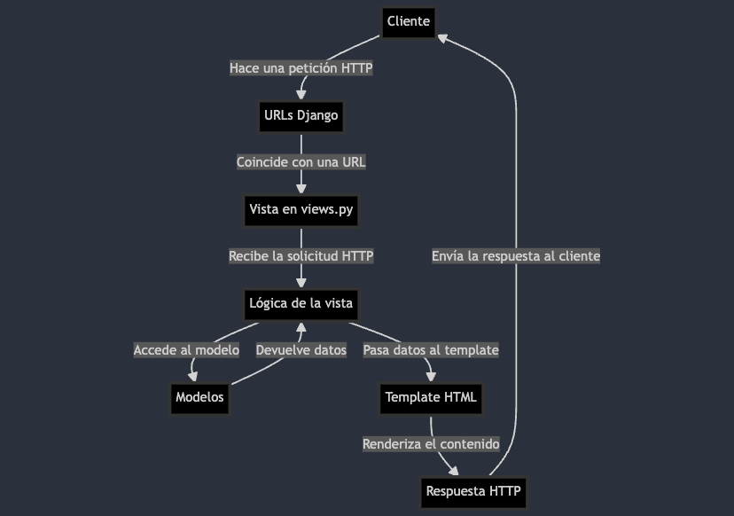

## Django

Es uno de los frameworks más populares de Python que sirve para backend y web apps completas. 

- El framework facilita la gestión de base de datos mediantes modelos. Django tiene un ORM (permite conectar a db con Python).
- Hay gestor de rutas para crear URLs
- Puedes gestionar recursos o logica mediante funciones o clases
- Te asegura unos mínimos estándares de calidad como: seguridad, velocidad, etc.
- Trae un **panel de administración** ya creado por defecto que podemos usar enseguida con nuestros modelos.
  - Hay un login, logout ya disponibles.

Django funciona con la estructura MVT:

- Model (`models.py`): modelos (clases) para tablas en base de datos
- View (`views.py`): vistas (funciones o métodos de clases) que se llaman cuando corresponde y aplican la lógica necesaria
- Template (`templates/`): HTML que se va a devolver como respuesta. Se puede aplicar lógia de Python
- Urls (`urls.py`): rutas habilitadas donde se pueden hacer peticiones

## W3Schools

- Tutorial: https://www.w3schools.com/django/index.php

1. Crear entorno virtual: `python -m venv .venv` # nombres habituales son `venv` o `.venv`
  - Para actualizar y que no salga warning con pip: `pip install --upgrade pip`
    - Comprobamos versiones: `python --version` y `pip --version`
  - Activar venv: `source .venv/bin/activate`, Windows: `.\<venv>\Scripts\activate`
    - Comprobar ubicación del venv: `which python`
  - Desactivar: `deactivate`
2. Instalación de Django en venv:
  - `pip list` -> debe mostrar pocas librerías
  - Con el venv activado: `pip install Django`
  - `pip list` -> debe aparecer `Django`
    - info de Django: `pip show Django`
  - Para ver la versión del gestor de Django: `django-admin --version`
3. Creación de Proyecto
  - Ejecutamos: `django-admin startproject my_tennis_club` -> debe aparecer una carpeta `my_tennis_club` (adecuado para varios proyectos)
    - Variante: `django-admin startproject my_tennis_club .` (<- punto final) adecuado cuando es el único proyecto // no hace la doble carpeta my_tennis_club
  - Renombro la carpeta de fuera como `proyecto`
## Django docs

## DRF